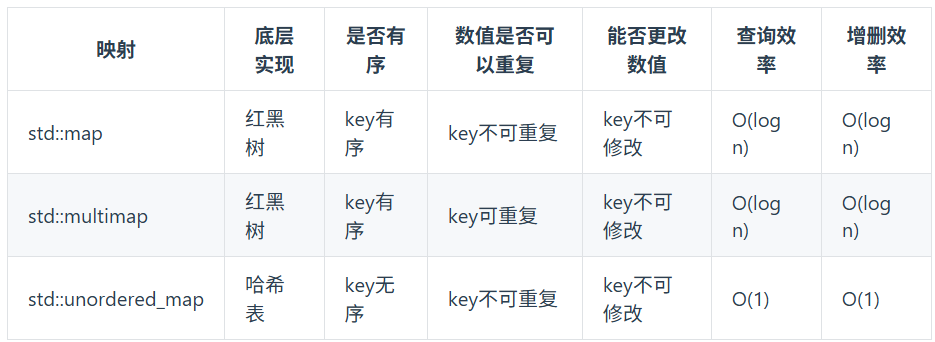

# 🚀 Day 03

## 链表
1. 单链表
2. 双链表：既可以向前查询，也可以向后查询
3. 循环链表：首尾相连
4. 可以**不连续分布**
5. 增/删节点：改变指针指向即可（删除时C++中最好手动释放内存）；时间复杂度均为O(1)

> 注意:链表的最后一个节点指针指向null空指针，再下一个就是野指针了，会报错。



## 链表定义
```cpp
struct ListNode{
    int val;
    ListNode *next;
    ListNode(int x):val(x),next(NULL){} // 节点的构造函数
}
// 使用自定义构造函数
ListNode* head = new ListNode(5);
// 使用默认构造函数(该构造函数不会初始化任何成员变量)
ListNode* head = new ListNode();
head->val = 5;
```

## 移除链表元素

### 🧩 题目描述

给你一个链表的头节点 head 和一个整数 val ，请你删除链表中所有满足 Node.val == val 的节点，并返回 新的头节点 。

> Leetcode 链接：[https://leetcode.cn/problems/remove-linked-list-elements/
](https://leetcode.cn/problems/remove-linked-list-elements/
)

---

### 🧠 解题思路
直接用原来的链表进行操作
```cpp
/**
 * Definition for singly-linked list.
 * struct ListNode {
 *     int val;
 *     ListNode *next;
 *     ListNode() : val(0), next(nullptr) {}
 *     ListNode(int x) : val(x), next(nullptr) {}
 *     ListNode(int x, ListNode *next) : val(x), next(next) {}
 * };
 */
class Solution {
public:
    ListNode* removeElements(ListNode* head, int val) {
        while(head!=NULL&&head->val==val){
            ListNode* tmp = head;
            head = tmp->next;
            delete tmp;
        }
        ListNode* cur = head;
        //while(cur != NULL&& cur->next != NULL ){
        while(cur->next != NULL && cur != NULL ){
            if(cur->next->val==val){
                ListNode* tmp = cur->next;
                cur->next = cur->next->next;
                delete tmp;
            }else{
                cur = cur->next;
            }
            
        }
        return head;
    }
};
```
>注意：&&是短路求值的，如果左侧为false，右侧就不会执行。所以应该先判断cur != NULL，如果他是空，则不可以再判断下一个节点，因其是野指针，会报错。

**设置一个虚拟头节点进行操作**
```cpp
class Solution {
public:
    ListNode* removeElements(ListNode* head, int val) {
        ListNode* dummynode(0);
        dummynode->next = head;
        
        while(dummynode != NULL && dummynode ->next !=NULL){
            if(dummynode->next->val == val){
                ListNode* tmp = dummynode->next;
                dummynode->next = dummynode->next->next;
                delete tmp;
            }else{
                dummynode = dummynode->next;
            }
        }
        return head;
    }
};
```
>是错误的，需要重新设一个cur节点，而将dummynode保留在原始位置，这样方便结束时返回头节点。
```cpp
class Solution {
public:
    ListNode* removeElements(ListNode* head, int val) {
        ListNode* dummynode(0);
        dummynode->next = head;
        ListNode* cur = head;
        while(cur!=NULL){
            if(cur->val==val){
                ListNode* tmp = cur;
                cur->next = 
                delete tmp;
            }
        }
    }
};
```
>这样做，会难以删除节点

```cpp
class Solution {
public:
    ListNode* removeElements(ListNode* head, int val) {
        ListNode* dummynode = new ListNode(0);
        dummynode->next = head;
        ListNode* cur = dummynode;
        while(cur->next != NULL){
            if(cur->next->val==val){
                ListNode* tmp = cur->next;
                cur->next = cur->next->next;//删除节点的关键语句
                delete tmp;
            }else{
                cur=cur->next;
            }
        }
        head = dummynode->next;
        //delete dummynode;
        return head;
    }
};
```
>需要注意如何创建新节点；最后最好删除虚拟节点

**递归的方法**
```cpp

```


## 设计链表
### 🧩 题目描述

你可以选择使用单链表或者双链表，设计并实现自己的链表。

单链表中的节点应该具备两个属性：val 和 next 。val 是当前节点的值，next 是指向下一个节点的指针/引用。

如果是双向链表，则还需要属性 prev 以指示链表中的上一个节点。假设链表中的所有节点下标从 0 开始。

实现 MyLinkedList 类：

MyLinkedList() 初始化 MyLinkedList 对象。
int get(int index) 获取链表中下标为 index 的节点的值。如果下标无效，则返回 -1 。
void addAtHead(int val) 将一个值为 val 的节点插入到链表中第一个元素之前。在插入完成后，新节点会成为链表的第一个节点。
void addAtTail(int val) 将一个值为 val 的节点追加到链表中作为链表的最后一个元素。
void addAtIndex(int index, int val) 将一个值为 val 的节点插入到链表中下标为 index 的节点之前。如果 index 等于链表的长度，那么该节点会被追加到链表的末尾。如果 index 比长度更大，该节点将 不会插入 到链表中。
void deleteAtIndex(int index) 如果下标有效，则删除链表中下标为 index 的节点。

> Leetcode 链接：[https://leetcode.cn/problems/design-linked-list/description/
](https://leetcode.cn/problems/design-linked-list/description/
)


## 反转链表


