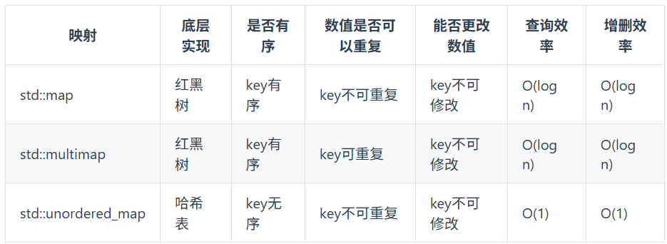

# Day 05

## 13. 有效的字母异同位 

### 题目描述
---
给定两个字符串 s 和 t ，编写一个函数来判断 t 是否是 s 的 字母异位词。
> Leetcode 链接：[https://leetcode.cn/problems/valid-anagram/description/](https://leetcode.cn/problems/valid-anagram/description/)
---

### 题解
---
```cpp
class Solution {
public:
    bool isAnagram(string s, string t) {
         int record[26] = {0};
         for(int i=0;i<s.size();i++){
            record[s[i]-'a']++;
         }
         for(int i=0;i<t.size();i++){
            record[t[i]-'a']--;
         }
         for(int i=0;i<26;i++){
            if(record[i])  return false;
         }
         return true;
    }
};
```
> 注意： record[s[i]-'a']++;
---
### ✅ 时间复杂度
---
O(n)
---
### ✅ 空间复杂度
---
O(1)
---

## 14. 两个数组的交集

### 题目描述
---
给定两个数组 nums1 和 nums2 ，返回 它们的 交集 。输出结果中的每个元素一定是 唯一 的。我们可以 不考虑输出结果的顺序 。
> Leetcode 链接：[https://leetcode.cn/problems/intersection-of-two-arrays/description/](https://leetcode.cn/problems/intersection-of-two-arrays/description/)
---

### 题解
---
```cpp
class Solution {
public:
    vector<int> intersection(vector<int>& nums1, vector<int>& nums2) {
        unordered_set<int> result;
        unordered_set<int> tmp(nums1.begin(),nums1.end());
        for(int num:nums2){
            if(tmp.find(num) != tmp.end())  result.insert(num);  
        }
        return vector<int> (result.begin(),result.end());
    }
};
```
---
### ✅ 时间复杂度
---
O(n     +m)：m 是最后要把 set转成vector
---
### ✅ 空间复杂度
---
O(n)
---


## 15. 快乐数

### 题目描述
---
编写一个算法来判断一个数 n 是不是快乐数。

「快乐数」 定义为：

对于一个正整数，每一次将该数替换为它每个位置上的数字的平方和。
然后重复这个过程直到这个数变为 1，也可能是 无限循环 但始终变不到 1。
如果这个过程 结果为 1，那么这个数就是快乐数。
如果 n 是 快乐数 就返回 true ；不是，则返回 false 。

示例 1：

输入：n = 19
输出：true
解释：
12 + 92 = 82
82 + 22 = 68
62 + 82 = 100
12 + 02 + 02 = 1
示例 2：

输入：n = 2
输出：false

> Leetcode 链接：[https://leetcode.cn/problems/happy-number/description/](https://leetcode.cn/problems/happy-number/description/)
---

### 题解
---
```cpp
class Solution {
public:
    int getSum(int n){
        int sum = 0;
        while(n){
            sum+=(n%10)*(n%10);
            n /= 10;
        }
        return sum;
    }
    bool isHappy(int n) {
        unordered_set<int> result;
        while(1){
            int sum = getSum(n);

            if(sum == 1){
                return true;
            }
            if(result.find(sum)!=result.end()){
                return false;
            }
            result.insert(sum);
            n = sum;
        }
    }
};
```
> 注意这里的int sum = 0;必须初始化，下方isHappy函数用到了循环
---
### ✅ 时间复杂度
---
O(logn)？？？？？？？？？？？？？？？？？？？？？？？
---
### ✅ 空间复杂度
---
O(logn)？？？？？？？？？？？？？？？？？？？？？？？
---


## 16. 两数之和

### 题目描述
---
给定一个整数数组 nums 和一个整数目标值 target，请你在该数组中找出 和为目标值 target  的那 两个 整数，并返回它们的数组下标。

你可以假设每种输入只会对应一个答案，并且你不能使用两次相同的元素。

你可以按任意顺序返回答案。

> Leetcode 链接：[https://leetcode.cn/problems/two-sum/description/](https://leetcode.cn/problems/two-sum/description/)
---

### 题解
---

```cpp
class Solution {
public:
    vector<int> twoSum(vector<int>& nums, int target) {
        unordered_map<int,int> map;
        for(int i=0;i<nums.size();i++){
            auto iter = map.find(target - nums[i]);
            if(iter != map.end()){
                return {iter->second,i};
            }
            map.insert(pair<int,int>(nums[i],i));
        }
        return {};
    }
};
```
---
> 本题不仅要知道元素有没有遍历过，还要知道这个元素对应的下标
### ✅ 时间复杂度
---
O(n)
---
### ✅ 空间复杂度
---
O(n)
---